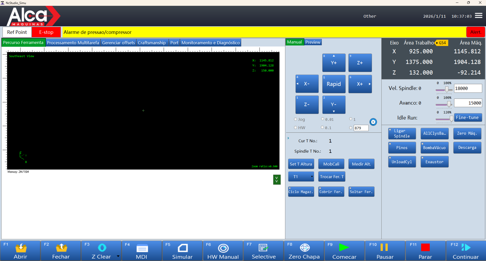

<p align="center">
  
</p>

<h1 align="center">NcStudio Translate</h1>

<p align="center">
  <strong>Um editor simples para traduzir a interface do NcStudio Phoenix</strong>
</p>

<p align="center">
  <a href="#-sobre">Sobre</a> •
  <a href="#-começando-rápido">Começando rápido</a> •
  <a href="#-screenshots">Screenshots</a> •
  <a href="#-requisitos">Requisitos</a> •
  <a href="#-instalação">Instalação</a> •
  <a href="#-como-usar">Como usar</a> •
  <a href="#-modelo-pré-traduzido">Modelo pré-traduzido</a> •
  <a href="#-contribuindo">Contribuindo</a> •
  <a href="#-licença">Licença</a>
</p>

---

## 📋 Sobre

O **NcStudio Translate** é um programa para Windows que ajuda você a **traduzir os textos da interface** do **NcStudio Phoenix**.

Em termos simples:

- O NcStudio Phoenix guarda os textos da interface em arquivos chamados **`.resx`** (arquivos de “recursos”).
- Muitas instalações vêm com textos em **chinês** (por exemplo `zh-CN`).
- Esta ferramenta cria uma “base em inglês” a partir do arquivo original e deixa você **editar as traduções** com mais conforto (tabela, busca, histórico e backup).

> Se você nunca mexeu com `.resx`, não tem problema: na prática você só vai **selecionar a pasta**, escolher o arquivo e **editar a coluna de tradução**.

### Compatibilidade

| Versão NcStudio Translate | Versão NcStudio Phoenix |
|---------------------------|-------------------------|
| 1.0.0                     | 15.550.25               |

> **Nota:** Embora desenvolvido para a versão acima, a ferramenta **pode funcionar com outras versões** do NcStudio Phoenix.
>
> ⚠️ **IMPORTANTE:** Antes de testar em outras versões, **faça um BACKUP COMPLETO** da pasta de instalação do NcStudio (geralmente `C:\Program Files\Weihong\NcStudio`).

### Para quem é?

- Operadores de CNC, técnicos e usuários que querem **usar o NcStudio Phoenix em outro idioma**.
- Pessoas que preferem **editar traduções com uma interface gráfica**, em vez de abrir arquivos na mão.

### Por que este projeto existe?

O NcStudio Phoenix é muito usado no CNC, mas uma interface em chinês pode atrapalhar no dia a dia. Este projeto surgiu para facilitar uma tradução para **pt-BR**, mas você pode adaptar para outros idiomas.

### ⚠️ Aviso de Responsabilidade

> **IMPORTANTE:** O uso desta ferramenta é de **total responsabilidade do usuário**. Os desenvolvedores não se responsabilizam por quaisquer danos, perdas de dados, mau funcionamento do NcStudio Phoenix ou problemas decorrentes do uso deste software. Sempre faça backup dos arquivos originais antes de qualquer modificação. Use por sua conta e risco.

## ⚡ Começando rápido

Se você quer só “rodar e traduzir”, o caminho mais simples é:

1. Baixe o `.zip` na página de [Releases](../../releases)
2. Extraia em uma pasta (ex.: `C:\NcStudioTranslate\`)
3. Abra o `NcStudioTranslate.exe`, selecione a pasta de `Resources` do NcStudio e comece a traduzir

> Dica: antes da primeira alteração, faça backup da pasta do NcStudio (principalmente a pasta `Resources`).

## 📸 Screenshots

Tela principal:



## ✨ O que o programa faz

- Mostra os arquivos `.resx` da pasta escolhida (lista à esquerda)
- Abre o conteúdo em uma tabela para você editar as traduções
- Faz **backup automático** antes de alterar o arquivo original
- Mantém um **log/histórico** das alterações
- Tem busca/filtro para achar textos mais rápido
- Oferece botões para abrir tradutores/IA (ChatGPT, Gemini, DeepSeek)

## 💻 Requisitos

- **Windows:** 10 ou 11
- **.NET:** 10.0 ou superior
- **RAM:** 512 MB (mínimo)
- **Disco:** 50 MB

## 📥 Instalação

### Opção 1: Download do executável (Recomendado)

1. Acesse a página de [Releases](../../releases)
2. Baixe a versão mais recente (`NcStudioTranslate-vX.X.X.zip`)
3. Extraia o conteúdo para uma pasta de sua preferência
4. Execute `NcStudioTranslate.exe`

### Opção 2: Compilar a partir do código fonte

```bash
# Clone o repositório
git clone https://github.com/dermicvas/NcStudio-Translate.git

# Entre no diretório do projeto
cd NcStudioTranslate/src

# Restaure as dependências e compile
dotnet build -c Release

# Execute
dotnet run
```

## 📖 Como Usar

### 1) Escolher a pasta certa

Clique em **Selecionar pasta** e escolha a pasta onde ficam os arquivos de idioma do NcStudio.

Na maioria dos casos, essa pasta fica parecida com:

- `C:\Program Files\Weihong\NcStudio\Bin\Resources`

> Se você não encontrar, procure dentro da instalação do NcStudio por uma pasta chamada `Resources`.

### 2) Escolher o arquivo

Depois de selecionar a pasta, você verá uma lista de arquivos `.resx` na lateral esquerda.

- Clique no arquivo que você quer traduzir.

### 3) Criar a base para tradução

Clique em **Criar tradução**. Esse botão é importante porque ele:

- Cria um backup do arquivo original (com extensão `.original`)
- Troca o conteúdo chinês por uma referência em inglês (para facilitar a tradução)
- Libera a edição na tabela

### 4) Traduzir na tabela

Agora é só editar os textos na coluna de tradução (geralmente “Atual”).

- Use o filtro/busca para achar palavras (suporta `*` e `?`)
- Se quiser, use as opções de IA/Tradutor para ajudar (e depois revise o texto)

### 5) Salvar

O programa salva automaticamente ao terminar a edição (quando você sai da célula editada).

### Se der algo errado (voltar atrás)

Se precisar recomeçar, use **Excluir tradução** para:

- Restaurar o arquivo original
- Remover o backup criado
- Voltar ao modo somente leitura

## 🧩 Modelo pré-traduzido

Para facilitar a vida de quem **só quer usar uma tradução pronta** (sem passar pelo processo de traduzir do zero), este repositório mantém um arquivo **pré-traduzido e comunitário**:

- `templates/StringResources.zh-CN.resx`

A ideia é simples:

- Quem não quiser traduzir agora pode **copiar e usar** esse arquivo como base.
- Quem quiser ajudar pode **melhorar a tradução aos poucos** e enviar PRs, mantendo o arquivo evoluindo com a comunidade.

### Como usar (modo “quero só traduzir”)

1. Faça backup do arquivo original do NcStudio (exemplo):
  - `C:\Program Files\Weihong\NcStudio\Bin\Resources\StringResources.zh-CN.resx`
2. Copie o arquivo do repositório:
  - `templates/StringResources.zh-CN.resx`
3. Cole na pasta `Resources` do NcStudio, substituindo o arquivo existente.

> ⚠️ **Importante:** versões diferentes do NcStudio Phoenix podem ter chaves a mais/menos. Sempre faça backup e valide após copiar.

### Como contribuir para completar a tradução

Se você encontrou termos estranhos, traduções incompletas ou quer padronizar textos, sua ajuda é muito bem-vinda.

Para manter o objetivo do projeto (editar `.resx` **pela aplicação**, não “no braço”), pedimos que:

- Não edite o arquivo manualmente em um editor de texto.
- Faça as alterações usando o **NcStudio Translate** (grid, filtro, histórico/log), assim o fluxo fica consistente e revisável.

Fluxo recomendado para contribuir com o template:

1. Faça um fork/clone do repositório.
2. Abra o NcStudio Translate e selecione a pasta `templates/`.
3. Edite as traduções no grid e salve.
4. Faça um PR descrevendo:
  - o que foi melhorado (termos/telas/contexto)
  - como validar (se você testou no NcStudio Phoenix e em qual versão)

Isso ajuda a manter um padrão de profissionalismo e facilita a revisão.

## 🏗️ Estrutura do Projeto

```
NcStudioTranslate/
├── src/                          # Código fonte
│   ├── Forms/                    # Formulários WinForms
│   │   ├── MainForm.cs          # Formulário principal
│   │   ├── MainForm.Designer.cs # Designer do formulário
│   │   └── MainForm.resx        # Recursos do formulário
│   ├── Models/                   # Classes de modelo
│   │   ├── ResourceEntry.cs     # Entrada de recurso
│   │   ├── ResxFileItem.cs      # Item de arquivo .resx
│   │   ├── LogEntry.cs          # Entrada de log
│   │   └── AppSettings.cs       # Configurações da aplicação
│   ├── Helpers/                  # Classes auxiliares
│   │   └── ZoomMessageBox.cs    # Caixas de diálogo com zoom
│   ├── Resources/               # Recursos da aplicação
│   │   ├── ico.ico              # Ícone da aplicação
│   │   ├── error.png            # Ícone de erro
│   │   ├── alert.png            # Ícone de alerta
│   │   ├── confirmation.png     # Ícone de confirmação
│   │   └── exclude.png          # Ícone de exclusão
│   ├── Program.cs               # Ponto de entrada
│   └── NcStudioTranslate.csproj # Arquivo de projeto
├── docs/                         # Documentação
├── templates/                    # Arquivos modelo (ex.: .resx pré-traduzidos para a comunidade)
├── .gitignore                   # Arquivos ignorados pelo Git
├── LICENSE                      # Licença de uso privativo (restritiva)
└── README.md                    # Este arquivo
```

## 🤝 Contribuindo

Contribuições são muito bem-vindas! Este é um projeto com código-fonte disponível no GitHub e adoraríamos sua ajuda para melhorá-lo.

### Como Contribuir

1. **Fork** o projeto
2. **Clone** seu fork: `git clone https://github.com/dermicvas/NcStudio-Translate.git`
3. **Crie uma branch** para sua feature: `git checkout -b feature/minha-feature`
4. **Faça commit** das suas alterações: `git commit -m 'Adiciona minha feature'`
5. **Push** para a branch: `git push origin feature/minha-feature`
6. Abra um **Pull Request**

### Diretrizes

- Siga o estilo de código existente
- Adicione comentários quando necessário
- Teste suas alterações antes de submeter
- Atualize a documentação se necessário
- Descreva claramente o que seu PR resolve

### Ideias para Contribuição

- 🌍 Suporte a outros idiomas além do português
- 🔍 Melhorias no sistema de busca
- 📊 Estatísticas de progresso da tradução
- 🎨 Temas claro/escuro
- 📱 Melhorias de acessibilidade
- 🧪 Testes unitários
- 📚 Documentação adicional

## 🐛 Reportando Bugs

Encontrou um bug? Por favor, abra uma [Issue](../../issues) com:

- Descrição clara do problema
- Passos para reproduzir
- Comportamento esperado vs. atual
- Screenshots (se aplicável)
- Versão do Windows e .NET

## 📄 Licença

Este projeto está licenciado sob uma licença **restritiva de uso privativo** (sem uso comercial, sem modificação e sem redistribuição) — veja o arquivo [LICENSE](LICENSE) para detalhes.

Em resumo:
- ✅ Uso privativo e não comercial
- ❌ Uso comercial
- ❌ Modificar/obras derivadas (exceto para submeter Pull Request neste repositório)
- ❌ Redistribuir (código, binários, forks/espelhos)

## 👏 Agradecimentos

- À comunidade open source por todas as ferramentas e inspiração
- A todos os contribuidores que ajudam a melhorar este projeto
- Aos usuários que reportam bugs e sugerem melhorias

## 📞 Contato

- **Issues:** [GitHub Issues](../../issues)
- **Discussions:** [GitHub Discussions](../../discussions)

---

<p align="center">
  Feito com ❤️ para a comunidade CNC
</p>

<p align="center">
  <sub>Se este projeto foi útil para você, considere dar uma ⭐</sub>
</p>
